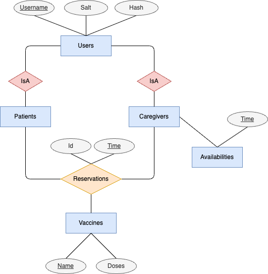

# vaccine-scheduler-java

### Entity–relationship model

### Setup
Create new db file ```test.db``` and create the tables using SQL queries defined in [create.sql](src/main/resources/sqlite/create.sql)
```shell
sqlite3 test.db
.read src/main/resources/sqlite/create.sql
```

### compile
```shell
./compile.sh
```

### run
```shell
./run.sh
```